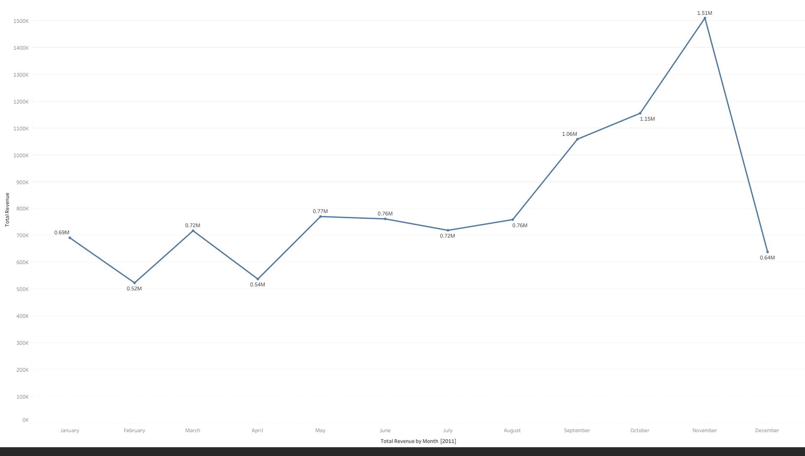

# Retail Sales Analysis with Tableau

## 📊 Project Overview
This project presents a data-driven analysis of retail sales using Tableau. The goal was to address key questions raised by the CEO and CMO regarding revenue trends, customer performance, and regional demand, using 2011 sales data.

## 🔍 Business Questions Answered

1. **Monthly Revenue Trend (2011)**  
   To identify seasonal revenue patterns and support demand forecasting.

2. **Top 10 Countries by Revenue (Excluding UK)**  
   To highlight high-performing international markets for focused marketing.

3. **Top 10 Customers by Revenue**  
   To identify high-value customers and inform retention strategies.

4. **Product Demand by Country (Excluding UK)**  
   To determine high-demand regions and evaluate expansion opportunities.

## 🧼 Data Cleaning
- Removed records where `Quantity < 1` to eliminate returns.
- Excluded entries with `Unit Price < 0` to remove data errors.
- Cleaned data was used across all visualizations for reliable analysis.

## 🖥️ Tools Used
- **Tableau** – Data visualization and dashboard creation
- **Excel** – Basic data cleaning and formatting

## 📁 Files Included
- `Questions.twb` – Tableau Workbook containing all dashboards
- `Retail_Analysis_Presentation.pptx` – Slide deck used for executive presentation
- `Presentation_Script.txt` – 5-minute narration script
- `data/` – (optional) Cleaned data in CSV format

## 📊 Dashboard Preview

This animation showcases:
- 📈 Monthly Revenue Trends (Q1)
- 🌍 Top Countries by Revenue (Q2)
- 👤 Top Customers by Revenue (Q3)
- 🗺️ Product Demand by Country (Q4)

## 🤝 Contact
Created by **Chaitanya (Chaitu)** – Reach out via GitHub or LinkedIn for collaboration or questions.