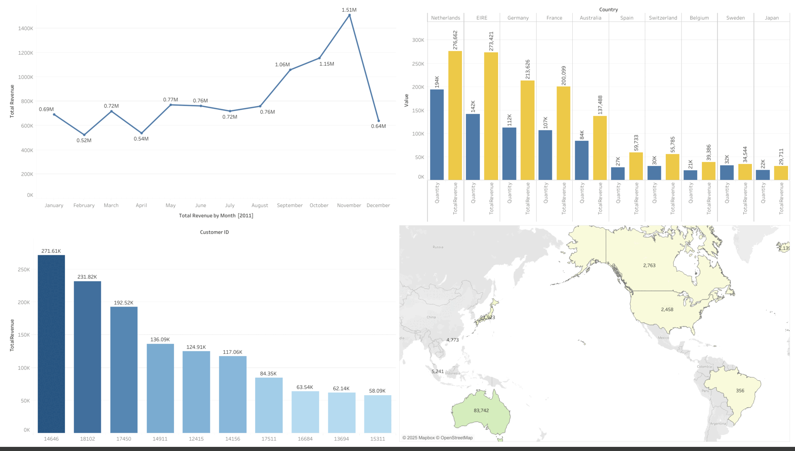
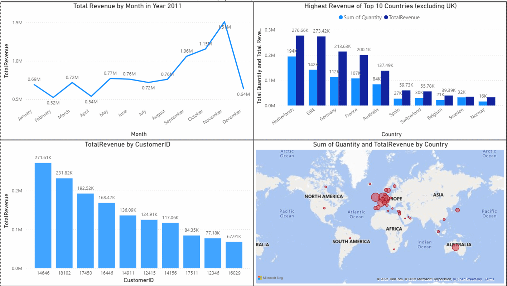

# 📊 Retail Sales Analysis Using Tableau
Welcome to the repository for my completed TATA Data Visualisation Virtual Experience Program hosted on The Forage. This simulation mimics real-world tasks performed by data analysts and visualisation professionals at TATA, focusing on insights-driven business reporting.

## 🚀 Project Overview
This virtual internship is designed to strengthen data analysis, storytelling, and dashboard creation skills using a real-world dataset from an online retail business. The project involves answering specific business questions raised by the CEO and CMO through insightful, clean, and interactive data visualisations.

I have worked on this project with both the tools, [Visuals below](#📊%20Dashboards%20Preview) i.e., 
- Tableau
- Power BI

## 📌 Task Breakdown
### ✅ Task 1: Data Cleaning
- Removed rows with negative quantities and zero/negative unit prices
- Filtered transactions for the year 2011
- Ensured consistent column formatting

### ✅ Task 2: Exploratory Data Analysis
- Framed the business questions from the CEO & CMO’s perspective:
- What are the monthly revenue trends?
- Which international countries (excluding the UK) are performing best?
- Who are our top customers?
- Where should we expand next?

### ✅ Task 3: Data Visualisation
- Created key visualisations using Power BI:
- Line chart for monthly revenue trends
- Bar chart for top 10 countries by revenue (excluding the UK)
- Bar chart for top 10 customers by revenue
- Map chart to highlight expansion opportunities by demand

### ✅ Task 4: Presentation
- Delivered a clear 5-minute business presentation answering stakeholder questions using insights from visualised data, including:
- Seasonality awareness (e.g., revenue peak in November)
- Expansion markets (e.g., Netherlands, Ireland, Australia)
- Retention strategy for high-value customers

## ⁉️ Business Questions Answered

1. **Monthly Revenue Trend of 2011**  
   To identify seasonal revenue patterns and support demand forecasting.

2. **Top 10 Countries by Revenue (Excluding UK)**  
   To highlight high-performing international markets for focused marketing.

3. **Top 10 Customers by Revenue**  
   To identify high-value customers and inform retention strategies.

4. **Product Demand by Country (Excluding UK)**  
   To determine high-demand regions and evaluate expansion opportunities.

## 🧼 Data Cleaning
- Removed records where `Quantity < 1` to eliminate returns.
- Excluded entries with `Unit Price < 0` to remove data errors.
- Cleaned data was used across all visualizations for reliable analysis.

## 🖥️ Tools Used
- **Tableau** – Data visualization and dashboard creation
- **Excel** – Basic data cleaning and formatting
- **PowerBI** - Created an alternate dashboard that of Tableau
- **Markdown** - Documentation
- **Notion** - Scripting and Summary (Notes)

## 📁 Files Included
- [`Visualization/TATA - Data Visualization Tableau.twbx`](https://github.com/darshbs/TATA-data-viz/blob/main/Visualization/TATA%20-%20Data%20Visualization%20Tableau.twbx) – Tableau Workbook containing dashboard and vizs
- [`Visualization/TATA-Data-Visualisation.pptx`](https://github.com/darshbs/TATA-data-viz/blob/main/Visualization/TATA-Data-Visualisation.pptx) – Slide deck used for executive presentation
- [`Visualization/Presentation_Script.md `](https://github.com/darshbs/TATA-data-viz/blob/main/Visualization/Presentation_Script.md) – 5-minute narration script
- [`Online Retail Dataset.xlsx`](https://github.com/darshbs/TATA-data-viz/blob/main/Online%20Retail%20Data%20Set.xlsx) – (optional) Raw Dataset in CSV format

## 📊 Dashboards Preview
### Tableau 

### PowerBI

This animation showcases:
- 📈 Q1. **Line Chart** - Monthly Revenue Trends of 2011 
- 🌍 Q2. **Side-by-Side Chart** - Top Countries by Revenue excluding UK 
- 👤 Q3. **Bar/Column Chart** - Top Customers by Revenue 
- 🗺️ Q4. **Map** - Product Demand by Country excluding UK

## 📧 Contact
Created by **Sai Darshan Balaji** 

Reach out via [LinkedIn](https://www.linkedin.com/in/saidarshanbalaji/), [Mail](mailto::saidarshan.balaji@gmail.com).
